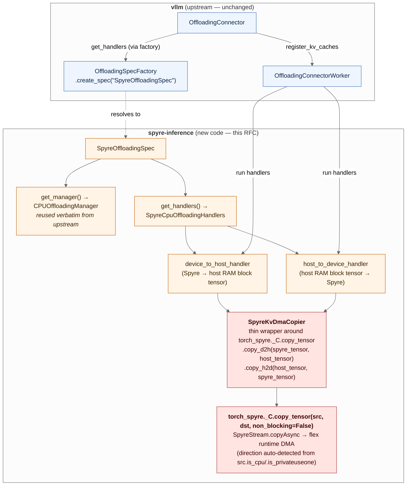

# RFC: Port the upstream KV Connector experience to spyre-inference

| Field | Value |
|---|---|
| Status | Draft |
| Authors | Chen Wang ([@wangchen615](https://github.com/wangchen615)), Yue Zhu ([@yuezhu1](https://github.com/yuezhu1)), Pravein Govindan Kannan ([@praveingk](https://github.com/praveingk)) |
| Created | 2026-06-05 |
| Updated | 2026-06-08 — rebased on the upstream multi-tier framework (`TieringOffloadingSpec`, `SecondaryTierManager`, `tiering/fs`, `tiering/obj`); incorporated review feedback from [@yuezhu1](https://github.com/yuezhu1) |
| Tracking | First design doc for [#76 — \[Epic\] Develop KVCacheConnector for Spyre](https://github.com/torch-spyre/spyre-inference/issues/76) |
| Related | vLLM `OffloadingConnector`, vLLM `TieringOffloadingSpec` (PR #40020), vLLM `tiering/fs` (PR #41735), vLLM `tiering/obj` (PR #41968), prior internal Spyre PD-disaggregation prototype |

## 1. Motivation

The upstream vLLM `OffloadingConnector` framework gives every CUDA platform three things for free:

1. A pluggable scheduler-side `OffloadingManager` that tracks where each block lives (G/H/F tiers).
2. A worker-side `OffloadingHandler` registry keyed by `(src_type, dst_type)` that performs the actual transfer.
3. An `OffloadingSpec` factory that lets out-of-tree platforms drop in their own manager + handlers without touching upstream code.

As of vLLM v0.22, this stack has grown a fourth layer — a first-class **multi-tier framework** that lets a single connector cascade across host RAM, filesystem, and object stores. M1.5 of this RFC targets that framework directly via a `SpyreTieringOffloadingSpec` plus the in-tree `tiering/{fs,obj}` secondary tiers; §3.5 walks the lineage.

The existing `spyre-inference` plugin has **none** of this wired up. `TorchSpyreWorker` extends `CPUWorker` and never calls `register_kv_caches`. Both the single-tier `CPUOffloadingSpec` and the new `TieringOffloadingSpec` (which subclasses `CPUOffloadingSpec`) error out on non-CUDA platforms via the `current_platform.is_cuda_alike()` check at `vllm/v1/kv_offload/cpu/spec.py:89`. So the entire upstream offload + tiering stack is unreachable from Spyre today, and the only KV-tier story we have is "the whole cache is on-device, full-stop."

Meanwhile, an earlier internal Spyre PD-disaggregation prototype has already demonstrated end-to-end KV transfer between two Spyre instances over NIXL, using a Spyre-specific device↔host copy primitive. That prototype is not packaged for vLLM's connector contract — it sits in standalone scripts that drive the model directly via `fms` — so it cannot ride the upstream connector ecosystem (LMCache, llm-d shared-storage backend, prefix caching, PD disaggregation) without an adaptor.

This RFC proposes how to combine the two: take the prototype's data-copy primitive, wrap it as an upstream-conformant `OffloadingHandler`, and register a `SpyreOffloadingSpec` so that the upstream `OffloadingConnector` works on Spyre. A small follow-on (`SpyreTieringOffloadingSpec`) extends the same handler with the `SecondaryTierManager` hook, so every secondary tier registered with `SecondaryTierFactory` (`fs`, `obj`, anything added later) works on Spyre with no per-tier plugin code, since secondary tiers only interact with primary(CPU)↔secondary(storage) transfers — they never touch device tensors. The Spyre-specific code stops at the device↔host primary tier, and everything above it is platform-agnostic upstream code.

## 2. Goals and non-goals

### Goals (M1)

- A user runs vLLM on Spyre with `--kv-transfer-config '{"kv_connector":"OffloadingConnector", "kv_connector_extra_config":{"spec_name":"SpyreOffloadingSpec","cpu_bytes_to_use":"8000000000"}}'` and gets host-RAM offload that survives across requests.
- The Spyre device↔host copy goes through one named, testable primitive (`SpyreKvDmaCopier`) that wraps `torch_spyre._C.copy_tensor(src, dst, non_blocking=False)` — the public, stream-backed Spyre↔CPU copy entrypoint already exposed in the dev-image-pinned torch-spyre commit. No new device-side primitives needed; no flit-offset / `perfdsc` parsing.
- `pytest tests/v1/kv_offload/` runs the same matrix as upstream for the CPU spec, plus a Spyre-specific test that round-trips a known-pattern block device→host→device.

### Goals (M1.5 — small follow-on, scoped here)

- A user runs vLLM on Spyre with `spec_name: "SpyreTieringOffloadingSpec"` plus a `secondary_tiers: [{type: "fs", root_dir: "/mnt/kvcache"}]` entry and gets host-RAM-plus-FS tiered offload, with content-hashed paths that two instances on a shared volume cross-share.
- Every `SecondaryTierManager` registered with `SecondaryTierFactory` (`fs`, `obj`, future tiers) works on Spyre with **no per-tier plugin code** beyond what M1.5 ships.
- M1.5 lands at most ~50 LOC of glue on top of M1; if it grows, the design is wrong — pause and revise.

Items explicitly out of scope (PD disaggregation, replacing the flit-offset addressing scheme, etc.) are listed in §11 alongside their owners and follow-up plans.

## 3. Background: what the upstream `OffloadingConnector` actually requires

Three abstraction points matter on the worker side. References are to vLLM `main` at the version this fork tracks.

### 3.1 `OffloadingConnector` (`vllm/distributed/kv_transfer/kv_connector/v1/offloading_connector.py:46`)

Constructed once per role (`SCHEDULER`/`WORKER`) and delegates to `OffloadingConnectorScheduler` or `OffloadingConnectorWorker`. The worker side calls `connector_worker.register_kv_caches(kv_caches)` with the `dict[str, torch.Tensor]` that the runner has already allocated. **This is the only ingestion point for the on-device KV cache** — everything downstream operates on tensors handed in here.

### 3.2 `OffloadingSpec` (`vllm/v1/kv_offload/base.py:319`)

The contract a platform implements:

- `get_manager() -> OffloadingManager` — scheduler-side bookkeeping (which blocks are where, eviction policy).
- `get_handlers(kv_caches) -> Iterator[(src_type, dst_type, OffloadingHandler)]` — worker-side transfer dispatch. The handler is asked to move a list of `(src_block_ids, dst_block_ids)` pairs and to expose a `get_finished()` poll for completion.

### 3.3 `CpuGpuOffloadingHandlers` (`vllm/v1/kv_offload/cpu/gpu_worker.py:375`)

The reference CUDA implementation. It is **not directly reusable on Spyre** because:

- It allocates `torch.cuda.Stream` per transfer (`spyre` has no public stream API; `_sync_device` in `TorchSpyreModelRunner` is a stub).
- It asserts `gpu_tensor.is_cuda` on every registered KV tensor.
- It calls `ops.swap_blocks_batch`, a custom CUDA op.
- Optional `cudaHostRegister` pinning via `cudart()`.

### 3.4 Dynamic spec loading (`vllm/v1/kv_offload/factory.py:21`)

`OffloadingSpecFactory.register_spec(name, module_path, class_name)` records a tuple but does **not** import the module at registration time. The actual import happens lazily in `create_spec(...)` when the user's `kv_connector_extra_config.spec_name` selects this spec. That matters for an out-of-tree platform plugin: we can register `SpyreOffloadingSpec` from `spyre_inference/__init__.py` without dragging in any Spyre-only module at vLLM import time, and CUDA-only deployments that load `spyre-inference` for unrelated reasons pay zero cost for our spec.

The same pattern applies to `SecondaryTierFactory.register_tier(...)` (`vllm/v1/kv_offload/tiering/factory.py`). Adding a new secondary tier from a third-party package — including ours, if M2 ever ships one — is a one-line registration call, not an upstream PR.

### 3.5 The v0.22 multi-tier layer

vLLM v0.22 added a multi-tier framework on top of the four pieces above:

- **`TieringOffloadingSpec`** (`vllm/v1/kv_offload/tiering/spec.py`, PR #40020) — a concrete `OffloadingSpec` that builds a `TieringOffloadingManager` over a CPU primary tier and one or more secondary tiers.
- **`SecondaryTierManager`** abstract base class (`vllm/v1/kv_offload/tiering/base.py`, PR #40020) — the contract any new tier must implement (`submit_store`, `submit_load`, `get_finished_jobs`, etc.). Cannot be instantiated directly; concrete tiers subclass it.
- **`SecondaryTierFactory`** (`vllm/v1/kv_offload/tiering/factory.py`, PR #40020) — the registry where tiers are plugged in by name (mirrors `OffloadingSpecFactory`).
- **In-tree concrete tiers:** `tiering/fs` (filesystem, PR #41735) and `tiering/obj` (object store, PR #41968), both subclassing `SecondaryTierManager`.

A deployment selects `spec_name: "TieringOffloadingSpec"` (a single spec) and lists secondary tiers in `extra_config`. The `TieringOffloadingManager` orchestrates a coherent hierarchy — primary CPU tier mmap'd via `SharedOffloadRegion`, plus one or more `SecondaryTierManager`s that read/write through a `primary_kv_view: memoryview`. Stores can cascade primary→secondary; loads can promote secondary→primary; the manager owns the bookkeeping.

This is the shape this RFC targets for M1.5 (see §4.1).

**Historical note on the prior llm-d shape.** llm-d v0.8 deployments use a different shape that pre-dates the v0.22 multi-tier framework: `MultiConnector` stacking two independent top-level `OffloadingSpec`s — typically one Spyre/CUDA `OffloadingSpec` for device↔host plus `SharedStorageOffloadingSpec` from the in-tree `llmd_fs_backend` module in [`llm-d/llm-d-kv-cache`](https://github.com/llm-d/llm-d-kv-cache) for host↔shared-storage. The two children operate in parallel without coordination — saves fan out to both, loads return from whichever child reports a hit first. The standalone PyPI package `llmd-fs-connector` was already EOL at `==0.22`; the maintainers of `llmd_fs_backend` (its in-tree successor in `llm-d/llm-d-kv-cache`) have signaled they are retiring it in favor of the upstream `TieringOffloadingSpec` + `tiering/fs` shape. **This RFC does not target the `MultiConnector + llmd_fs_backend` shape**: it points at a moving target on the way out, and the upstream-canonical replacement is what M1.5 builds against.

## 4. Background: device↔host copy in current torch-spyre

torch-spyre exposes a public, stream-backed copy entrypoint that handles both directions and is already in the dev-image-pinned commit (`4dcfee15c3a93446`):

```python
import torch
import torch_spyre._C as _C   # registered as a private extension; no extra deps

cpu_t   = torch.empty_like(spyre_t, device="cpu")
_C.copy_tensor(spyre_t, cpu_t, non_blocking=False)   # device → host

cpu_in  = torch.zeros(..., dtype=...)
spyre_in = torch.empty(..., device="spyre")
_C.copy_tensor(cpu_in, spyre_in, non_blocking=False) # host → device
```

`copy_tensor(src, dst, non_blocking=False)` is bound in [`torch_spyre/csrc/module.cpp:272`](https://github.com/torch-spyre/torch-spyre/blob/4dcfee15c3a9344652f067149ec65c4bf2941890/torch_spyre/csrc/module.cpp#L272) → `spyre::spyre_copy_from` ([`torch_spyre/csrc/spyre_mem.cpp:581`](https://github.com/torch-spyre/torch-spyre/blob/4dcfee15c3a9344652f067149ec65c4bf2941890/torch_spyre/csrc/spyre_mem.cpp#L581)) → `SpyreStream::copyAsync` ([`torch_spyre/csrc/spyre_stream.cpp:142`](https://github.com/torch-spyre/torch-spyre/blob/4dcfee15c3a9344652f067149ec65c4bf2941890/torch_spyre/csrc/spyre_stream.cpp#L142)) → `copyAsyncImpl`, which invokes the flex runtime's DMA. Direction is auto-detected from `src.is_cpu()` / `src.is_privateuseone()`; no separate H2D/D2H entrypoints. With `non_blocking=False`, `spyre_copy_from` calls `stream.synchronize()` after the DMA, so callers can treat it as synchronous; `non_blocking=True` returns immediately and the caller is responsible for syncing.

This is the only device↔host primitive M1 uses. Earlier internal Spyre prototypes drove the device DMA queues directly (`libsenlib` `DmaiQPush`/`DmaoQPush`, addressed via `flit_offset` parsed from `perfdsc/metadata.json`); those layers existed before torch-spyre exposed `copy_tensor` and are not reused here. With `copy_tensor` available, the connector handler operates on plain `torch.Tensor` arguments and never touches senlib, flit offsets, or perfdsc artifacts.

### 4.1 Data paths in scope

| Path | Milestone | Compose how | Notes |
|---|---|---|---|
| Spyre device ↔ host RAM (single tier) | **M1** | `OffloadingConnector` + `SpyreOffloadingSpec` | Single-tier offload; survives across requests. |
| Spyre device ↔ host RAM ↔ filesystem / object | **M1.5** | `OffloadingConnector` + `SpyreTieringOffloadingSpec` + `tiering/fs` or `tiering/obj` | The v0.22-canonical shape. Internal cascade managed by `TieringOffloadingManager`. Supersedes the prior `MultiConnector + llmd_fs_backend` deployment shape (see §3.5). |
| Direct Spyre device ↔ filesystem / object store | Out of scope | n/a | Would require a Spyre-side analogue of NVIDIA GDS so a secondary tier can DMA without a host bounce. Not provided by torch-spyre today, and the upstream `SecondaryTierManager` contract assumes the `primary_kv_view` is over CPU memory; supporting this would change both. Filed as a future-work item in §11. |

Both M1 and M1.5 reuse the same `SpyreOffloadingSpec` device↔host primary-tier handler — M1.5 only adds the `SecondaryTierManager` plumbing on top via `SpyreTieringOffloadingSpec`. The choice between `tiering/fs` and `tiering/obj` (or any future `SecondaryTierManager`) is a deployment-time config choice, not plugin code. With matching `PYTHONHASHSEED`, two Spyre instances on a shared `tiering/fs` `root_dir` cross-share blocks via the upstream content-hashed `FileMapper` scheme.

## 5. Proposed architecture

<!-- Source: figures/spyre-offloading-arch.mmd. Regenerate the SVG with:
       npx -y -p @mermaid-js/mermaid-cli@10 mmdc \
         -i docs/architecture/rfcs/figures/spyre-offloading-arch.mmd \
         -o docs/architecture/rfcs/figures/spyre-offloading-arch.svg \
         -b transparent
-->



<details>
<summary>Mermaid source for the diagram above (also at <code>figures/spyre-offloading-arch.mmd</code>)</summary>



</details>

Key shape: **only `SpyreCpuOffloadingHandlers` and `SpyreKvDmaCopier` are new code on the Spyre side.** Everything above (manager, factory, scheduler-side connector, eviction policies, llm-d composition) is unchanged upstream code.

### 5.1 Why we don't subclass `CpuGpuOffloadingHandlers`

The upstream class is structured around `torch.cuda.Stream`/`torch.Event`. Even ignoring the `is_cuda` assert, half the methods (`get_finished`, `wait`, `shutdown`) call `event.query()` / `event.synchronize()` / `event.elapsed_time()`. There is no "swap CUDA for Spyre" override point. A clean implementation of the same interface (`OffloadingHandler` from `vllm/v1/kv_offload/worker/worker.py`) is shorter than working around the CUDA assumptions.

### 5.2 Why we reuse `CPUOffloadingManager` verbatim

The manager is pure bookkeeping. It is keyed by `LoadStoreSpec` types, not by tensor backends, and the upstream pluggable cache policy registry (`lru`, `arc`) handles eviction. Nothing in it is CUDA-specific.

## 6. Component design

### 6.1 `SpyreKvDmaCopier`

```python
# spyre_inference/v1/kv_offload/copier.py
import torch
import torch_spyre._C as _spyre_c


class SpyreKvDmaCopier:
    """Single-purpose owner of every host↔Spyre KV byte transfer.

    Thin wrapper around torch_spyre._C.copy_tensor, which is bound to
    SpyreStream.copyAsync → flex runtime DMA. Direction is auto-detected
    inside the C++ binding from src.is_cpu() / src.is_privateuseone(),
    so we expose two named methods purely for handler readability — both
    delegate to the same underlying call.
    """

    def copy_d2h(self, src_spyre: torch.Tensor, dst_host: torch.Tensor) -> None:
        _spyre_c.copy_tensor(src_spyre, dst_host, non_blocking=False)

    def copy_h2d(self, src_host: torch.Tensor, dst_spyre: torch.Tensor) -> None:
        _spyre_c.copy_tensor(src_host, dst_spyre, non_blocking=False)
```

Constraints:

- Both methods are synchronous (`non_blocking=False` causes `spyre_copy_from` to call `stream.synchronize()` after the DMA). M1 does not pursue async overlap; an async path is a follow-up tracked in §11 ("Async DMA on Spyre").
- Neither method allocates. The handler caller owns allocation.
- A single instance is shared across both directions; the class holds no state beyond the bound `_C.copy_tensor` reference, so it is effectively a namespace.

Why a class at all instead of inlining `_C.copy_tensor` into the handler? Two reasons. First, the `OffloadingHandler` shouldn't import `torch_spyre._C` directly — keeping the device-side primitive behind one wrapper means tests can monkey-patch `SpyreKvDmaCopier` without touching the C extension. Second, if torch-spyre later adds an async or batched copy entrypoint, swapping `SpyreKvDmaCopier`'s implementation is a one-file change; everything above it stays unchanged.

### 6.2 `SpyreCpuOffloadingHandlers`

```python
# spyre_inference/v1/kv_offload/handlers.py
class SpyreCpuOffloadingHandlers:
    def __init__(self,
                 kv_caches: CanonicalKVCaches,
                 block_size_factor: int,
                 num_cpu_blocks: int,
                 copier: SpyreKvDmaCopier): ...

    @property
    def device_to_host_handler(self) -> OffloadingHandler: ...
    @property
    def host_to_device_handler(self) -> OffloadingHandler: ...
```

Each direction is a `_SingleDirectionSpyreHandler(OffloadingHandler)` that:

1. On `transfer(spec)`, walks the `(src_block_ids, dst_block_ids)` pairs and calls `copier.copy_{d2h,h2d}` for each pair.
2. Returns a synchronous `TransferResult` with a job id, byte count, and elapsed time measured by `time.perf_counter()` (no CUDA events).
3. `get_finished()` drains the in-flight queue (which is always already done because every transfer is sync).
4. `shutdown()` clears references to the registered tensors.

Block tensors on the host side are a single `torch.empty(num_cpu_blocks, page_size_bytes, dtype=torch.int8)` per attention group, allocated at `__init__` time. We do **not** pin via `cudaHostRegister` — there is no equivalent on Spyre.

### 6.3 `SpyreOffloadingSpec`

```python
# spyre_inference/v1/kv_offload/spec.py
class SpyreOffloadingSpec(OffloadingSpec):
    def __init__(self, vllm_config, kv_cache_config):
        super().__init__(vllm_config, kv_cache_config)
        cpu_bytes = self.extra_config.get("cpu_bytes_to_use")
        if not cpu_bytes:
            raise ValueError("cpu_bytes_to_use must be set ...")
        # ... compute self.num_blocks identically to CPUOffloadingSpec
        self._copier = SpyreKvDmaCopier()
        self._manager = None
        self._handlers = None

    def get_manager(self) -> OffloadingManager:
        # Identical to CPUOffloadingSpec.get_manager (reuse upstream class).

    def get_handlers(self, kv_caches):
        if not self._handlers:
            self._handlers = SpyreCpuOffloadingHandlers(
                kv_caches=kv_caches,
                block_size_factor=self.block_size_factor,
                num_cpu_blocks=self.num_blocks,
                copier=self._copier,
            )
        yield GPULoadStoreSpec, CPULoadStoreSpec, self._handlers.device_to_host_handler
        yield CPULoadStoreSpec, GPULoadStoreSpec, self._handlers.host_to_device_handler
```

`GPULoadStoreSpec` is the upstream "device-side" type — it is a tag, not CUDA-specific, so we use it for Spyre. (The upstream class is named `GPULoadStoreSpec` for historical reasons; the tag is platform-agnostic.)

### 6.4 `SpyreTieringOffloadingSpec` (M1.5)

The upstream `TieringOffloadingSpec` (`vllm/v1/kv_offload/tiering/spec.py`) layers a `TieringOffloadingManager` over the same primary-tier handlers we already build in M1. Its only Spyre-incompatible piece is its `CPUOffloadingSpec` parentage, which inherits the `is_cuda_alike()` gate.

M1.5 ships a sibling spec that mirrors the upstream tiering shape but uses our handlers:

```python
# spyre_inference/v1/kv_offload/tiering_spec.py
class SpyreTieringOffloadingSpec(SpyreOffloadingSpec):
    """Spyre primary tier + upstream secondary tiers (fs, obj, ...).

    Mirrors vllm.v1.kv_offload.tiering.spec.TieringOffloadingSpec, but
    inherits from SpyreOffloadingSpec instead of CPUOffloadingSpec so it
    skips the CUDA gate. Reuses upstream TieringOffloadingManager and
    SecondaryTierFactory verbatim.
    """

    def __init__(self, vllm_config, kv_cache_config):
        super().__init__(vllm_config, kv_cache_config)
        self.secondary_tier_configs = self.extra_config.get("secondary_tiers", [])
        if not isinstance(self.secondary_tier_configs, list):
            raise ValueError("secondary_tiers must be a list of tier configurations")

    def get_manager(self) -> OffloadingManager:
        # Build a TieringOffloadingManager wrapping a CPUPrimaryTierOffloadingManager
        # over our SharedOffloadRegion, plus one SecondaryTierManager per
        # entry in self.secondary_tier_configs (resolved via SecondaryTierFactory).
        ...
```

The `SharedOffloadRegion` (`vllm/v1/kv_offload/cpu/shared_offload_region.py`) is an mmap-backed CPU buffer; the `primary_kv_view: memoryview` it produces is what every `SecondaryTierManager` reads/writes from. Nothing in `SharedOffloadRegion` is CUDA-specific — it's plain `mmap` plus `multiprocessing.shared_memory`. We reuse it as-is.

User invocation:

```bash
--kv-transfer-config '{
  "kv_connector": "OffloadingConnector",
  "kv_connector_extra_config": {
    "spec_name": "SpyreTieringOffloadingSpec",
    "cpu_bytes_to_use": "8000000000",
    "secondary_tiers": [
      {"type": "fs", "root_dir": "/mnt/kvcache", "n_read_threads": 16}
    ]
  }
}'
```

For cross-instance sharing on a shared `root_dir`, set `PYTHONHASHSEED` to the same value on every instance — the upstream `FileSystemTierManager` documents this requirement (its block filenames depend on the `NONE_HASH` chain seed, which is randomized per-process otherwise).

### 6.5 Registration

In `spyre_inference/__init__.py`, after the existing platform plugin registration:

```python
from vllm.v1.kv_offload.factory import OffloadingSpecFactory

OffloadingSpecFactory.register_spec(
    "SpyreOffloadingSpec",
    "spyre_inference.v1.kv_offload.spec",
    "SpyreOffloadingSpec",
)

# Added in M1.5:
OffloadingSpecFactory.register_spec(
    "SpyreTieringOffloadingSpec",
    "spyre_inference.v1.kv_offload.tiering_spec",
    "SpyreTieringOffloadingSpec",
)
```

This mirrors how the upstream CPU spec is registered. No changes to `TorchSpyrePlatform`, no changes to `TorchSpyreWorker` — the connector is selected by `kv-transfer-config` at engine init.

### 6.6 Worker-side glue

`OffloadingConnectorWorker.register_kv_caches` is invoked by the engine after `_allocate_kv_cache_tensors` returns. This already happens through the upstream `KVConnectorBase_V1` machinery — **no plugin change is needed** as long as the tensors `_allocate_kv_cache_tensors` returns are real `torch.Tensor` objects on `device("spyre")`. They are: see `spyre_model_runner.py:339–345` (`device="spyre"`).

The one thing we have to verify in implementation is that `OffloadingConnectorWorker` does not assert tensor device type before handing the `kv_caches` dict to our spec. If it does, we fix that in upstream vLLM with a one-liner.

## 7. File-by-file plan

### M1 files

New files in `spyre_inference/v1/kv_offload/`:

| File | Purpose | Approx LOC |
|---|---|---|
| `__init__.py` | empty | 0 |
| `copier.py` | `SpyreKvDmaCopier` (thin wrapper around `torch_spyre._C.copy_tensor`) | ~30 |
| `handlers.py` | `SpyreCpuOffloadingHandlers`, `_SingleDirectionSpyreHandler` | ~180 |
| `spec.py` | `SpyreOffloadingSpec` | ~70 |

Modified files:

| File | Change |
|---|---|
| `spyre_inference/__init__.py` | Add `OffloadingSpecFactory.register_spec(...)` call for `SpyreOffloadingSpec`. |
| `pyproject.toml` | None — `torch_spyre._C.copy_tensor` is already exposed by the existing torch-spyre pin (`4dcfee15c3a93446`). |

New tests in `tests/v1/kv_offload/`:

| File | Coverage |
|---|---|
| `test_copier_round_trip.py` | Allocate a Spyre tensor with a known fp16 pattern, copy d2h, mutate host copy, copy h2d, assert content. Skipped if `device("spyre")` not available (CI gating already exists for other Spyre tests). |
| `test_spec_registration.py` | Import `spyre_inference`, then `OffloadingSpecFactory.create_spec(...)` resolves. Pure-CPU test — no Spyre device required. |
| `test_handler_dispatch.py` | Exercise `device_to_host_handler` / `host_to_device_handler` against `(src, dst)` tuples and assert the correct content lands. |

### M1.5 files (incremental)

| File | Purpose | Approx LOC |
|---|---|---|
| `spyre_inference/v1/kv_offload/tiering_spec.py` | `SpyreTieringOffloadingSpec` (subclasses `SpyreOffloadingSpec`; reuses upstream `TieringOffloadingManager` + `SecondaryTierFactory`) | ~50 |
| `spyre_inference/__init__.py` | Add a second `OffloadingSpecFactory.register_spec(...)` call for `SpyreTieringOffloadingSpec`. | +5 |
| `tests/v1/kv_offload/test_tiering_spec.py` | Pure-CPU test: build a `SpyreTieringOffloadingSpec` with a `dummy` secondary tier, store/load through the cascade, assert promotion semantics match upstream. | ~120 |

## 8. Compatibility with existing connectors and tiers

The two seams that matter:

1. **Device↔host hop** — `OffloadingSpec.get_handlers`. M1 makes this work on Spyre by registering `SpyreCpuOffloadingHandlers`.
2. **Host↔secondary hop** — `SecondaryTierManager.submit_store`/`submit_load`. M1.5 makes upstream's `tiering/*` framework usable on Spyre by giving `SpyreTieringOffloadingSpec` the same shape as upstream's `TieringOffloadingSpec`.

After M1 + M1.5 ship, the following work on Spyre **without further plugin code**:

- **Single-tier host-RAM offload** (M1) — via `SpyreOffloadingSpec`. Same prefix-cache semantics as the upstream CPU spec on CUDA.
- **`tiering/fs` secondary tier** (`vllm/v1/kv_offload/tiering/fs/manager.py:FileSystemTierManager`) — pure-Python disk-backed tier with content-hashed paths via `FileMapper`. With matching `PYTHONHASHSEED`, two Spyre instances on a shared `root_dir` (e.g. RWX PVC) cross-share blocks. Replaces the standalone `llmd-fs-connector` (EOL as of v0.22).
- **`tiering/obj` secondary tier** (PR #41968) — object-store backend (S3-style).
- **`tiering/example` secondary tier** — in-memory tier shipped upstream as a reference implementation; we use it in tests.
- **Future secondary tiers** — anything someone registers with `SecondaryTierFactory.register_tier(name, module, class)` works on Spyre as soon as it works on CUDA, since the Spyre-specific code stops at the primary tier.
- **LMCache connectors that route through the `OffloadingHandler` device↔host seam** — M1 alone is enough. LMCache ships several connector flavors, not all of which use this seam (some implement their own CUDA copy path); M1 supports the ones that do, and the others would need an LMCache-side change to swap their device↔host hop for `SpyreKvDmaCopier` (this is the M2 use case in §11).

The only connector that does **not** drop in is anything that requires async copy semantics (e.g. CUDA-graph-capturable transfers). None of the M1/M1.5-relevant tiers do — the upstream `SecondaryTierManager` contract is explicitly async-via-job-poll, not async-via-CUDA-events.

## 9. Migration: from the prior PD prototype to upstream

For users currently running the prior standalone NIXL demo, the migration shape is:

| Today (prior prototype) | After this RFC |
|---|---|
| Standalone `demo.py --role prefill/decode` | `vllm serve --kv-transfer-config '{"kv_connector":"OffloadingConnector",...}'` on each side |
| Prototype's accessor driven directly from script | `SpyreKvDmaCopier` driven by the handler |
| Custom NIXL connector module | Upstream `NixlConnector` does the cross-host hop after the device→host hop is in place |
| Cross-instance sharing via custom router copies | Built-in via M1.5's `tiering/fs` over a shared volume; filenames are computed from the upstream offload-key chain hash, so two instances must run with matching `PYTHONHASHSEED`. |
| flit-offsets read from `perfdsc` JSON | Same — until torch-spyre exposes a stable descriptor (filed separately) |

The PD-disaggregation half of the prior prototype (custom NIXL connector and `CpuBufferManager`) is out of scope for this RFC — see §11 for the follow-up plan.

## 10. Open questions

1. ~~**Device↔host primitive.**~~ **Resolved:** `torch_spyre._C.copy_tensor(src, dst, non_blocking=False)` is bound in the dev-image-pinned torch-spyre commit (`4dcfee15c3a93446`), routes through `SpyreStream::copyAsync`, and handles both H→D and D→H by auto-detecting the direction from `src.is_cpu()` / `src.is_privateuseone()`. M1's `SpyreKvDmaCopier` is a thin wrapper over this single entrypoint (see §6.1). The earlier debate about `senlib_dma` fallbacks vs. unmerged DMPA accessors is no longer relevant — the device-side primitive M1 needs already exists in the dev image.
2. **`OffloadingConnectorWorker` device assertions.** Does any code in the worker path call `.is_cuda` on the registered tensors? A quick grep at implementation time will tell us; if so, we land a one-liner upstream.
3. **TP > 1.** `SpyreCommunicator` currently only supports TP=2. The connector handler operates per-rank, so TP>1 should be transparent, but we should verify the `kv_caches` dict the worker hands us at TP=2 contains exactly the local-rank slice. (It does on CUDA; we expect the same on Spyre because both go through the same upstream allocator.)
4. **Block alignment.** Spyre's `_allocate_kv_cache_tensors` rounds `num_blocks` up to a multiple of 64 (`spyre_model_runner.py:336`). The upstream `block_size_factor` machinery assumes the GPU/device block count and the offloaded block count are integer-related, which holds, but the alignment slack means a few blocks at the end are unusable. We should document this in the spec and not try to "use" the alignment slack on the host side.
5. **`SpyreOffloadingSpec` parent class.** Two viable bases: subclass `OffloadingSpec` directly (clean, but we duplicate the ~30 lines of `__init__` math from `CPUOffloadingSpec` that compute `num_blocks` from `cpu_bytes_to_use`); or subclass `CPUOffloadingSpec` and override `get_handlers` to skip the `is_cuda_alike()` gate (less duplication, but inherits a parent that documents itself as CUDA-only). The implementation will pick one once we see how much of `CPUOffloadingSpec` is genuinely CUDA-coupled vs. just gated. M1.5's `SpyreTieringOffloadingSpec` then subclasses whichever we picked, so the choice cascades.
6. **Mmap region on Spyre.** M1.5's `SpyreTieringOffloadingSpec` needs to allocate host-side block tensors from a `SharedOffloadRegion` so that every `SecondaryTierManager` can read/write through its `primary_kv_view: memoryview`. M1 can build host blocks with `torch.empty` since there is no secondary tier; M1.5 swaps that allocator. Cost is small (one-line allocator swap) but worth noting up front so M1's `SpyreCpuOffloadingHandlers` accepts an optional pre-built region.

## 11. Out of scope (filed as follow-ups)

- **M2 — Public Spyre device↔host primitive for third-party connectors.** Promote `spyre_inference.v1.kv_offload.copier.SpyreKvDmaCopier` to a stable, documented import surface so out-of-tree connectors that today target CUDA's `swap_blocks_batch` / `cudaMemcpy` can swap their device↔host hop for Spyre by importing one symbol. M1 builds the primitive; M2 commits to its API and documents it. (Raised by [@yuezhu1](https://github.com/yuezhu1) on the M1 draft.)
- **Direct device ↔ filesystem / object store.** Would need a Spyre-side analogue of NVIDIA GDS so a secondary tier can read/write device memory without a host bounce. Requires both a torch-spyre primitive and a contract change to upstream's `SecondaryTierManager` (which today takes a `primary_kv_view: memoryview` over CPU memory). Tracked separately. (Raised by [@yuezhu1](https://github.com/yuezhu1).)
- **PD disaggregation on Spyre.** Standalone RFC, builds on M1. Every component PD needs *except* the cross-host transport is delivered by M1 — the follow-up is purely about wiring a NIXL agent into the upstream PD producer/consumer connectors. The prior prototype's NIXL connector and `CpuBufferManager` get two *hosts* exchanging CPU tensors over the network; M1 makes the device→host hop stand on its own, so that NIXL adapter can be lifted into a PD-specific RFC without re-doing the device-side work.
- **Async DMA on Spyre.** Depends on torch-spyre exposing a stream/event API. Until then, the synchronous handler is fine for offload/prefetch but precludes overlap with compute.
- **Stable on-device KV descriptor.** Depends on torch-spyre. Not blocking M1 — `_C.copy_tensor` operates on `at::Tensor` allocations directly (no flit-offset addressing). Filed separately for the future case where a Spyre-side direct-storage path needs a descriptor independent of an allocated tensor.
- **Authoring a new secondary tier.** Anything that does not slot into an existing `SecondaryTierManager` (e.g. a Spyre-to-Spyre direct fabric tier) is a separate design, not a milestone of this RFC.

## 12. Acceptance criteria

Each milestone's acceptance is a literal `vllm serve` invocation a deployment engineer can run, plus the observable behavior that confirms it works.

### M1 acceptance

**A1.1 — single-tier host-RAM offload runs end-to-end.**

```bash
vllm serve <model> --kv-transfer-config '{
  "kv_connector": "OffloadingConnector",
  "kv_role": "kv_both",
  "kv_connector_extra_config": {
    "spec_name": "SpyreOffloadingSpec",
    "cpu_bytes_to_use": 8000000000,
    "lazy_offload": true
  }
}'
```

- [ ] Server boots. `OffloadingConnectorWorker.register_kv_caches` is reached on the Spyre worker without raising.
- [ ] A two-prompt sweep where the second prompt extends the first by ≥256 tokens reports a host-tier hit on the second prompt. Concretely: the worker log emits `OffloadingConnectorWorker: loading N blocks from host` (or the same `kv_offload_blocks_loaded` counter exposed by `OffloadingConnectorScheduler.get_metrics()` in v0.22, depending on which interface the deployment scrapes) with `N > 0`. Either source is sufficient — pick one in the test harness.
- [ ] With `temperature=0`, generated tokens for both prompts are byte-identical to a baseline run with the same model and `--kv-transfer-config` omitted. (No tolerance — `temperature=0` is deterministic.)

**A1.2 — plugin-side test suite green.**

- [ ] `pytest spyre_inference/tests/v1/kv_offload/test_copier_round_trip.py` passes on a Spyre runner.
- [ ] `pytest spyre_inference/tests/v1/kv_offload/test_spec_registration.py` and `test_handler_dispatch.py` pass on CPU-only runners.

**A1.3 — no plugin-platform-side regressions.**

- [ ] No source changes required to `TorchSpyreWorker` or `TorchSpyrePlatform` for M1 to land. (If we have to change them, the RFC's premise is wrong — pause and revise.) Verified by inspecting the M1 PR diff: `spyre_inference/v1/worker/` and `spyre_inference/platform.py` are unchanged.
- [ ] The existing Spyre platform/worker test suite (`pytest spyre_inference/tests/ -k 'not kv_offload'`) passes both with `SpyreOffloadingSpec` registered (M1 default after `spyre_inference` is imported) and with the connector unselected (no `--kv-transfer-config`). Same suite, two configs, both green — confirms registration alone has no effect when the connector isn't selected.
- [ ] `bash format.sh` clean. (`format.sh` at the repo root is this repo's lint wrapper around `uvx prek`; runs `--all-files` if no arg is given.)

### M1.5 acceptance

**A1.5.1 — `SpyreTieringOffloadingSpec` + `tiering/fs` runs end-to-end.**

```bash
vllm serve <model> --kv-transfer-config '{
  "kv_connector": "OffloadingConnector",
  "kv_role": "kv_both",
  "kv_connector_extra_config": {
    "spec_name": "SpyreTieringOffloadingSpec",
    "cpu_bytes_to_use": 8000000000,
    "secondary_tiers": [
      {"type": "fs", "root_dir": "/mnt/kvcache", "n_read_threads": 16}
    ]
  }
}'
```

- [ ] **Boot.** Server boots; `OffloadingConnectorWorker.register_kv_caches` is reached without raising; the `TieringOffloadingManager` reports primary tier (CPU) plus one secondary tier (`fs`).
- [ ] **Store side.** After a warmup prompt, block files appear under `/mnt/kvcache/<safe_model_name>_<sha256-prefix>_r<rank>/<hhh>/<hh>_g<group_idx>/<hash>.bin` (upstream `FileMapper` content-hashed layout).
- [ ] **Load side, same instance.** Restart the server with the same config, same model, and same `PYTHONHASHSEED`. Send a second prompt that shares its first ≥256 tokens with the warmup prompt. Worker log reports a hit from the secondary tier (`kv_offload_blocks_loaded` increment attributable to the `fs` tier). Generated tokens are byte-identical to a no-cache baseline at `temperature=0`.
- [ ] **Load side, cross-instance.** On a second host mounting the same `/mnt/kvcache` (RWX volume) with the same `PYTHONHASHSEED`, a fresh `vllm serve` with the same config picks up the warmed prefixes on the first request — no second-host warmup needed. Tokens identical.
- [ ] **Outputs match M1 baseline.** Run A1.1's two-prompt sweep under the A1.5.1 config; tokens identical to A1.1's single-tier run at `temperature=0`.

**A1.5.2 — plugin-side test suite green.**

- [ ] `pytest spyre_inference/tests/v1/kv_offload/test_tiering_spec.py` passes on CPU-only runners using the upstream `example` secondary tier.

**A1.5.3 — Engineering budget held.**

- [ ] M1.5 plugin-side LOC ≤ ~50 LOC of glue on top of M1, excluding tests. If A1.5.1 surfaces issues that require Spyre-side handler changes (rather than reusing `SpyreCpuOffloadingHandlers` from M1), reassess the budget and revise this RFC.

## 13. References

- Upstream `OffloadingConnector`: `vllm/distributed/kv_transfer/kv_connector/v1/offloading_connector.py`
- Upstream `OffloadingSpec`: `vllm/v1/kv_offload/base.py:319`
- Upstream CPU spec (CUDA-only today): `vllm/v1/kv_offload/cpu/spec.py`
- Upstream factory: `vllm/v1/kv_offload/factory.py:21`
- Upstream tiering framework (PR #40020, merged 2026-05-13): `vllm/v1/kv_offload/tiering/{base,manager,spec,factory}.py`
- Upstream FS secondary tier (PR #41735, merged 2026-05-24): `vllm/v1/kv_offload/tiering/fs/manager.py`
- Upstream object-store secondary tier (PR #41968, merged 2026-06-05): `vllm/v1/kv_offload/tiering/obj/`
- Upstream `SharedOffloadRegion`: `vllm/v1/kv_offload/cpu/shared_offload_region.py`
- Upstream `FileMapper` (content-hashed paths): `vllm/v1/kv_offload/file_mapper.py`
- Upstream `OffloadingConnector` user-facing usage guide (single- and multi-tier): [vllm-project/vllm#44415](https://github.com/vllm-project/vllm/pull/44415) — adds `docs/features/kv_offloading_usage.md`, the canonical end-user reference for the deployment shape M1.5 targets.
- Prior llm-d shape (historical context, see §3.5): [`llm-d/llm-d-kv-cache`](https://github.com/llm-d/llm-d-kv-cache) — `llmd_fs_backend` / `SharedStorageOffloadingSpec`. Not targeted by this RFC; included for readers migrating from existing llm-d v0.8 deployments.
- Spyre KV allocation today: `spyre_inference/v1/worker/spyre_model_runner.py:322–368`
