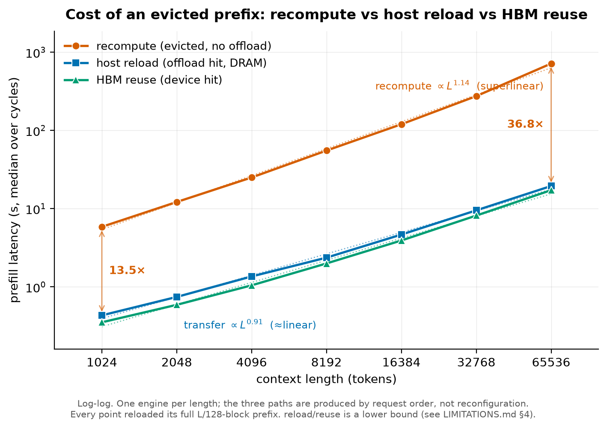
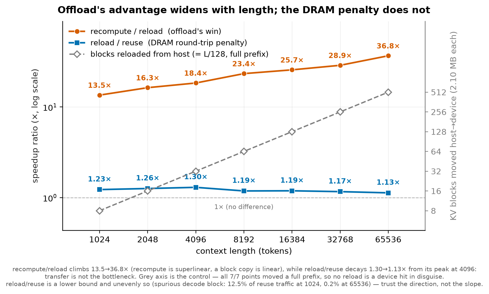

# KV-offload eviction/reload experiments

Measurement scripts written while validating the KV-offload PoC
(`dev/0807-kv-offload-yzhu`) on the `torch-aiu-runtime-dev` dev pod.

**This branch deliberately does not modify the offload implementation.** It branches
from the pristine PoC commit (`75fb119`) and only *adds* this directory, so the
diff against `dev/0807-kv-offload-yzhu` stays reviewable and the branch does not
deviate from upstream.

Full write-up, results, and build instructions:
`hillock-vmem@experiments/kvc-offload-evict/`.

## What each script is for

| script | purpose |
|---|---|
| `verify_correctness.py` | 24-token greedy comparison, offload on vs off — proves the reload path returns the *right* KV, not just fast KV |
| `run_length_sweep.sh` | offload on vs off across lengths (the headline speedup curve) |
| `traffic_three_way.py` | recompute / host-reload / HBM-reuse in **one** engine, paths selected by request order |
| `run_traffic_sweep.sh` | driver: fresh engine per length, N cycles each |
| `run_full_sweep_detached.sh` | all six long lengths in one go, `setsid nohup`-safe so it survives SSH disconnection (~5 h) |
| `plot_three_way.py` | renders the two figures below; **needs only matplotlib** — no Spyre, no venv, no pod |
| `three_way.py` | earlier 3-engine variant; superseded (it had to vary the pool between cases) |
| `run_tight_hbm.sh` | tightest-legal device pool, roomy host pool |
| `run_matrix.sh` | prefix-caching × offload matrix |

## Results

Measured on the `torch-aiu-runtime-dev` dev pod against this branch's PoC code:
`micro-g3.3-8b-instruct-1b`, one AIU, `block_size=128`, `pool_mult=1.5`,
`host_gb=64`, `OMP_NUM_THREADS=8`. Medians over 6–10 cycles.

The three paths come from **request order inside a single engine** — one pool, one
config, one process — so nothing differs between the cases except what the engine had
cached. That is the point of `traffic_three_way.py`; an earlier 3-engine variant had to
vary the pool between cases and produced an artifact (see below).

| length | recompute | host reload | HBM reuse | rec/reload | reload/reuse | blocks loaded (want `L/128`) |
|---:|---:|---:|---:|---:|---:|---:|
| 1024 | 5.846 s | 0.432 s | 0.352 s | **13.5×** | 1.23× | 8 / 8 ✓ |
| 2048 ¹ | 12.147 s | 0.743 s | 0.589 s | **16.3×** | 1.26× | 16 / 16 ✓ |
| 4096 | 24.995 s | 1.358 s | 1.045 s | **18.4×** | 1.30× | 32 / 32 ✓ |
| 8192 | 55.169 s | 2.361 s | 1.991 s | **23.4×** | 1.19× | 64 / 64 ✓ |
| 16384 | 119.755 s | 4.657 s | 3.912 s | **25.7×** | 1.19× | 128 / 128 ✓ |
| 32768 | 274.012 s | 9.496 s | 8.150 s | **28.9×** | 1.17× | 256 / 256 ✓ |
| 65536 | 714.463 s | 19.435 s | 17.201 s | **36.8×** | 1.13× | 512 / 512 ✓ |

¹ Measured later in a **separate process**, same host and configuration, to even out the
x-axis (1024→4096 is a 4× gap where every other step is 2×). Its own three ratios are
single-process like every other row, but 2048-vs-neighbours is a cross-process
comparison. It interpolates cleanly on all three paths, which is the check that it
belongs on the curve.





Two trends, opposite directions:

- **`rec/reload` climbs 13.5 → 36.8×** over a 64× range. Fitting the measured curves
  gives recompute ∝ `L^1.14` against transfer ∝ `L^0.91` — superlinear computation
  against near-linear data movement, so the gap must widen. Offload's advantage is
  structural rather than a constant factor.
- **`reload/reuse` peaks at 4096 and then decays, 1.30 → 1.13×.** The DRAM round-trip
  becomes a *smaller* relative penalty as prompts grow. If transfer were the
  bottleneck, moving 64× more bytes would make the penalty grow. At 65536, 512 blocks
  is 1.08 GB in 19.4 s — under 0.06 GB/s, orders of magnitude below the PCIe 32 GT/s ×16
  link.

The `reload/reuse` series is **not monotonic**: it rises 1.23 → 1.26 → 1.30 before
falling. The decay from the peak is the load-bearing claim and holds across the four
longest lengths. The run-up sits where this measurement's known bias is worst — `reuse`
carries one spurious decode-block load, which is 12.5% of reuse traffic at 1024, 6.3% at
2048, 3.1% at 4096 and 0.2% at 65536 — so `reload/reuse` is a **lower bound**, and
unevenly so. Read its direction, not its slope.

Both exponents are averages over 1024–65536, **not asymptotic**: recompute's local slope
rises ~1.06 → 1.38 across the sweep while the copy's converges to ~1.03. `L^1.14`
therefore understates recompute past 65536 and should not be extrapolated. The mechanism
claim is stronger locally (1.38 vs 1.03) than in the global fit.

**Two things the block accounting caught, which timing alone could not:**

- `loaded == L/128` on every row above is the check that each "reload" moved the prompt's
  **entire** prefix from host DRAM. A first pass sized the junk equal to the prompt, which
  displaces only `pool − blk` blocks, so half of each "reload" was silently a device hit —
  and that flattered `reload/reuse` by ~5× in penalty terms (4–6% instead of 23–30%).
  A mislabelled fast path is indistinguishable from a genuine win on a latency plot.
- Ordering is **reuse ≤ reload ≤ recompute at all seven lengths**. An earlier
  cross-configuration comparison had suggested a DRAM reload beating an HBM hit, which is
  physically impossible; it was an artifact of varying `block_size`, pool, `max_model_len`
  and code base at once, and does not reproduce here.

Correctness is checked before any timing claim: all P1 responses are token-identical
across recompute, reload and reuse at every length.

**Scope caveat:** the pool is derived from the prompt (`pool = 1.5 × blk + 1`) so that one
prompt roughly fills the device and eviction is guaranteed. That is what makes the three
paths separable, and it is *not* a realistic deployment — the pool is a different absolute
size at every point, there is no batching or concurrency, and `max_model_len` follows the
junk rather than the prompt. Read these as **the cost of each path in isolation**, not as
an expected end-to-end serving speedup. Full limitations in
`hillock-vmem@experiments/kvc-offload-evict/docs/LIMITATIONS.md`.

### Regenerating the figures

`plot_three_way.py` carries the measured sweep inline, so the figures rebuild anywhere
matplotlib is installed:

```bash
python3 plot_three_way.py                       # -> figures/
python3 plot_three_way.py --from-progress PROGRESS   # or re-parse a driver's own output
```

Note `run_full_sweep_detached.sh`'s `PLAN` still lists the original six lengths, so
reproducing the 2048 point is a separate one-length invocation:

```bash
LENGTHS="2048" CYCLES=10 HOST_GB=64 ./run_traffic_sweep.sh
```

`HOST_GB=64` matters — the driver's own default is smaller, and an undersized host tier
silently produces pessimistic numbers rather than an error (see the `--cpu-bytes` finding
below).

## Portability

The `run_*.sh` drivers were written for one specific pod and hardcode:

- `NEW=/tmp/work-kvoffload` — the build tree
- `source ~/spyre-build/repro/scripts/env.sh` — sets `DTI_PROJECT_ROOT`,
  `SEN_PROJECT_SRC`, and **appends** to `LD_LIBRARY_PATH`
- `SENLIB_DEVEL_CONFIG_FILE=/etc/ibm/spyre/senlib_config.json`
- `OMP_NUM_THREADS=8` — the pod's cgroup CPU quota is 8 while the container sees
  192; without pinning, thread oversubscription costs ~13%

Adjust these paths before running elsewhere. The Python scripts have no such
assumptions and can be run directly with `uv run --no-sync python <script>`.

## Findings that affect anyone using `ttft_evict.py`

1. **The `--cpu-bytes` default (2.0 GB) is too small for L=65536.** Two 65536-token
   prompts need ~2.15 GB at 2.10 MB/block, so the host tier thrashes: only 440 of
   512 blocks reload, `stored` climbs without plateau, and timings never converge
   (360 → 148 → 147 s, still descending). At 8 GB it plateaus at 18.579 s ±1.6%.
   The default silently yields a ~8× pessimistic result.

2. **Engine-construction failures are silently swallowed.** `TransferCounter` dups
   fd 1/2 to a temp file *before* the engine is built and restores them only in
   `close()`. If `LLM()` raises, the visible log ends after ~12 lines with no error
   and the traceback goes to `/tmp/tmp*.ttft_evict.log`. The scripts here restore
   descriptors in a `finally` block instead — worth porting into `ttft_evict.py`.

3. **Eviction geometry decides whether a "reload" is real.** Sizing the junk/other
   prompt equal to the measured prompt only displaces `pool - blk` blocks, so half
   the "reload" is actually a device hit. See `TRAFFIC_DESIGN.md` in the hillock
   repo for the full derivation.

## Build note (not committed here)

**No code change was needed to run these experiments.** The offload implementation
is exactly as Yue wrote it. The only local deviation is build metadata, and it is
environment-specific rather than a fix:

```toml
# pyproject.toml
-torch-spyre = { git = "https://github.com/torch-spyre/torch-spyre", rev = "88964c0..." }
+torch-spyre = { path = "../torch-spyre", editable = true }
```

Both `pyproject.toml` and `uv.lock` pin torch-spyre to
`88964c010ac8eb9586ba5deac938ae4624c2f5a1`, which is correct — it carries the
DeepTools header-relocation fix needed against the `ibm-deeptools
2.0.0-0.main.1+1861.3bb8422` in the pod base image. The repoint exists only so
`uv` reuses the torch-spyre already built at that commit in
`/tmp/work-kvoffload/torch-spyre` instead of re-cloning and recompiling it
(~25 min on this pod). It is deliberately **not** committed.

Consequences: `--frozen` is no longer possible and numpy resolves to 2.3.5, outside
the declared `<2.3` bound (no failures observed).

## Relationship to `dev/kv-offload-m1-yzhu`

These scripts target **`dev/0807-kv-offload-yzhu`** (`75fb119`) and do **not** work
against `dev/kv-offload-m1-yzhu`, which is a separate later rewrite rather than a
descendant (`75fb119` is not an ancestor of it; the diff is 142 files,
+21121/−16730). In particular `m1-yzhu` deletes `kv_offload/worker.py` in favour of
`kv_offload/handlers.py`, so the `SpyreOffloadingWorker device->host/host->device`
log lines that the block accounting scrapes do not exist there — every step would
silently report `loaded=0`. Porting requires finding the equivalent counters in
`handlers.py` and updating the regex in `traffic_three_way.py`.
